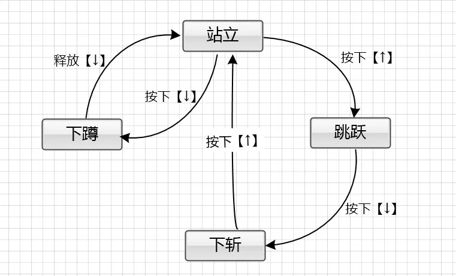

# Welcome to wstate 👋

[](https://www.npmjs.com/package/wstate)
[](https://github.com/zhangkun-Jser/wstate#readme)
[](https://github.com/zhangkun-Jser/wstate/graphs/commit-activity)
[](https://github.com/zhangkun-Jser/wstate/blob/master/LICENSE)

A library for finite state machines.



<br>

<br>

# Installation

In a browser:

```html
<script src="state-machine.js"></script>
```

> after downloading the [source](dist/state-machine.js) or the [minified version](dist/state-machine.min.js)

Using npm:

```shell
  npm install --save-dev wstate
```

In Node.js:

```javascript
var StateMachine = require("wstate");
```

# Usage

A state machine can be constructed using:

```javascript
var fsm = new StateMachine({
  init: "solid",
  transitions: [
    { name: "melt", from: "solid", to: "liquid" },
    { name: "freeze", from: "liquid", to: "solid" },
    { name: "vaporize", from: "liquid", to: "gas" },
    { name: "condense", from: "gas", to: "liquid" },
  ],
  methods: {
    onMelt: function () {
      console.log("I melted");
    },
    onFreeze: function () {
      console.log("I froze");
    },
    onVaporize: function () {
      console.log("I vaporized");
    },
    onCondense: function () {
      console.log("I condensed");
    },
  },
});
```

... which creates an object with a current state property:

- `fsm.state`

... methods to transition to a different state:

- `fsm.melt()`
- `fsm.freeze()`
- `fsm.vaporize()`
- `fsm.condense()`

... observer methods called automatically during the lifecycle of a transition:

- `onMelt()`
- `onFreeze()`
- `onVaporize()`
- `onCondense()`

... along with the following helper methods:

- `fsm.is(s)` - return true if state `s` is the current state
- `fsm.can(t)` - return true if transition `t` can occur from the current state
- `fsm.cannot(t)` - return true if transition `t` cannot occur from the current state
- `fsm.transitions()` - return list of transitions that are allowed from the current state
- `fsm.allTransitions()` - return list of all possible transitions
- `fsm.allStates()` - return list of all possible states

# Terminology

A state machine consists of a set of States 
- solid
- liquid
- gas

A state machine changes state by using Transitions 
- melt
- freeze
- vaporize
- condense

A state machine can perform actions during a transition by observing Lifecycle Events 

- onBeforeMelt
- onAfterMelt
- onLeaveSolid
- onEnterLiquid
- ...

A state machine can also have arbitrary Data and Methods 

Multiple instances of a state machine can be created using a State Machine Factory 


# Author

👤 **keenzhang**

- Github: [@keenzhang](https://github.com/zhangkun-Jser)

## 🤝 Contributing

Contributions, issues and feature requests are welcome!

Feel free to check [issues page](https://github.com/zhangkun-Jser/wstate/issues).

## Show your support

Give a ⭐️ if this project helped you!

## 📝 License

Copyright © 2021 [keenzhang](https://github.com/zhangkun-Jser).

This project is [MIT](https://github.com/zhangkun-Jser/wstate/blob/master/LICENSE) licensed.


